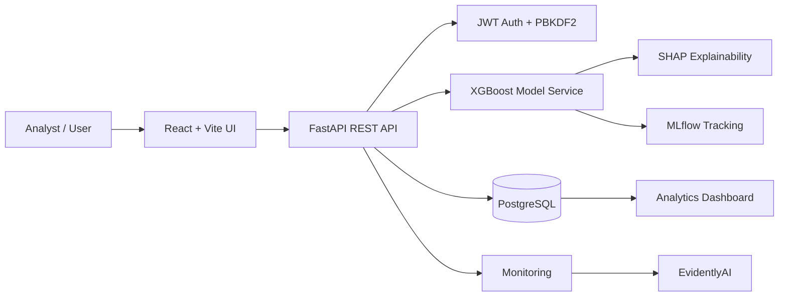

# CreditRisk AI

> Explainable loan-default prediction platform built around XGBoost, SHAP, FastAPI, PostgreSQL, MLflow and EvidentlyAI.

[](https://www.python.org/)
[](https://fastapi.tiangolo.com/)
[](https://react.dev/)
[](https://www.postgresql.org/)
[](https://xgboost.readthedocs.io/)
[](https://mlflow.org/)

## Overview

CreditRisk AI is a full-stack credit-risk prototype that predicts the probability of loan default and presents an interpretable risk assessment through a web dashboard.

The project was developed around the HCL P_137 **Loan Default Prediction** problem context and demonstrates an end-to-end workflow:

**historical loan data → data preparation → model training → explainability → REST inference API → PostgreSQL persistence → monitoring**

### Important data note

This repository uses a public Kaggle/LendingClub-style historical loan dataset for development and evaluation. It does **not** contain Bank Muscat production/customer data and should not be represented as a production banking system.

## Key Features

- XGBoost-based loan default probability prediction
- Model comparison with Logistic Regression and Random Forest
- SHAP-based feature explanations
- FastAPI inference and authentication APIs
- JWT authentication with PBKDF2 password hashing
- PostgreSQL-backed users and prediction history
- React dashboard for risk analytics and prediction workflows
- MLflow experiment/model tracking
- EvidentlyAI-based reference drift analysis
- Dockerized PostgreSQL development environment
- Prediction history and applicant detail views

## Model Results

| Model | ROC-AUC |
|---|---:|
| Logistic Regression | 0.6816 |
| Random Forest | 0.7040 |
| **XGBoost** | **0.7157** |

**Selected model:** XGBoost  
**Evaluation:** hold-out test split  
**Dataset:** 27,003 cleaned historical loan records  
**Class balance:** 85.27% non-default / 14.73% default

### Selected SHAP features

`int_rate`, `annual_inc`, `term`, `revol_util`, `funded_amnt_inv`, `inq_last_6mths`, `purpose`, `loan_amnt`, `funded_amnt`, `installment`

## Architecture



See the detailed architecture notes in [`docs/ARCHITECTURE.md`](docs/ARCHITECTURE.md).

## Main User Flow

1. User creates an account or signs in.
2. FastAPI validates credentials and returns a JWT.
3. User enters borrower, credit and loan details.
4. The API transforms the request into the model feature representation.
5. XGBoost returns the default probability and risk level.
6. SHAP generates the major contributing factors.
7. Prediction + explanation are stored in PostgreSQL.
8. History, analytics and monitoring pages read from the application database.

## Tech Stack

### Frontend
- React.js
- Vite
- Tailwind CSS
- React Router
- Axios
- Recharts
- Lucide React

### Backend
- Python
- FastAPI
- Uvicorn
- SQLAlchemy
- Pydantic
- JWT
- PBKDF2-SHA256 password hashing
- XGBoost
- SHAP

### Data / MLOps
- PostgreSQL
- MLflow
- EvidentlyAI
- Docker

## Local Setup

### 1. Clone

```bash
git clone https://github.com/<YOUR_USERNAME>/CreditRiskAI.git
cd CreditRiskAI
```

### 2. Backend environment

Use the project's existing backend virtual environment or create a new Python 3.11 environment.

```powershell
.\backend\.venv\Scripts\Activate.ps1
```

Install backend dependencies according to the committed requirements file.

### 3. Environment variables

Do not commit secrets. Copy the example environment files and replace placeholders locally.

```text
frontend/.env.example
backend/.env.example
```

### 4. Start PostgreSQL

```powershell
docker compose up -d
```

### 5. Start FastAPI

```powershell
.\backend\.venv\Scripts\python.exe -m uvicorn backend.app.main:app --host 127.0.0.1 --port 8000
```

### 6. Start React

```powershell
npm run dev
```

Open:

- Frontend: `http://localhost:5173`
- FastAPI: `http://127.0.0.1:8000`
- FastAPI health: `http://127.0.0.1:8000/health`

### 7. Start MLflow

```powershell
.\backend\.venv\Scripts\python.exe -m mlflow server --host 127.0.0.1 --port 5000
```

Open `http://127.0.0.1:5000`.

## API Overview

| Method | Endpoint | Purpose |
|---|---|---|
| POST | `/auth/login` | Authenticate user |
| POST | `/auth/register` | Create user account |
| GET | `/health` | Service/database/model health |
| POST | `/predict` | Score a loan application |
| GET | `/predictions` | Prediction history |
| GET | `/dashboard/stats` | Dashboard metrics |
| GET | `/analytics` | Filtered analytics |
| GET | `/monitoring` | Model/monitoring metrics |
| GET | `/applicants/{id}` | Applicant details |

## Repository Structure

```text
CreditRiskAI/
├── backend/
│   ├── app/
│   ├── data/
│   ├── models/
│   ├── .env.example
│   └── requirements.txt
├── src/
│   ├── components/
│   ├── hooks/
│   ├── layouts/
│   ├── pages/
│   ├── services/
│   └── styles/
├── docs/
│   ├── ARCHITECTURE.md
│   └── images/
├── .github/
│   └── workflows/
├── docker-compose.yml
├── frontend.env.example
├── package.json
└── README.md
```

## Screenshots

Add 3–4 final screenshots under `docs/images/` and keep this section near the top of the repository homepage.

Suggested set:

- `dashboard.png`
- `prediction.png`
- `monitoring.png`
- `login.png`

## Monitoring and MLOps

The project includes two different monitoring concepts:

- **Model evaluation:** hold-out ROC-AUC, precision, recall and F1.
- **Data drift:** EvidentlyAI reference comparison.

The current drift report is a baseline/reference analysis. Meaningful production drift requires a growing stream of live prediction data.

## Limitations

- Current XGBoost hold-out ROC-AUC is **0.7157**, so the project should not claim an 85% AUC production target has been achieved.
- The data is historical/public rather than Bank Muscat production data.
- Current deployment is local-development oriented; cloud deployment is a future production step.
- Monitoring currently starts from a reference baseline and becomes more representative as live prediction history grows.

## Roadmap

- Improve model performance through feature engineering, imbalance handling and tuned hyperparameters.
- Add automated model retraining/evaluation pipelines.
- Add production cloud deployment.
- Add CI/CD and stronger automated test coverage.
- Replace local tracking configuration with a shared MLflow backend for team deployment.

## Portfolio Positioning

This project demonstrates a practical combination of:

**Machine Learning + Backend Engineering + Database Engineering + Explainable AI + MLOps + Full-Stack Development**

It is intended as a portfolio/academic implementation rather than a production banking decision engine.

## Author

**Sahil Ali**  
B.Tech CSE

