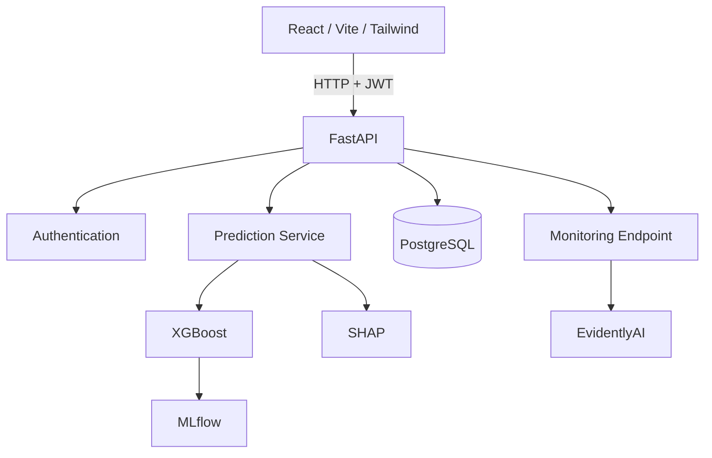
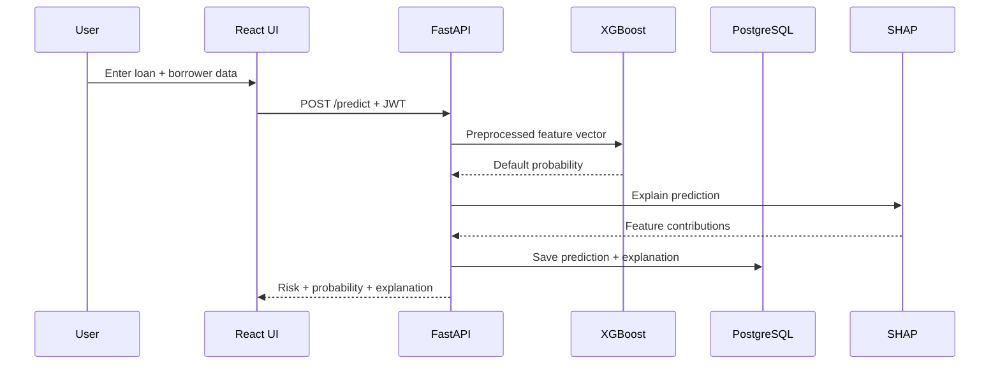

# CreditRisk AI — Architecture Notes

## 1. High-Level Architecture



## 2. Prediction Flow



## 3. Authentication

```text
Register/Login
    ↓
FastAPI
    ↓
PBKDF2-SHA256 password verification/hashing
    ↓
PostgreSQL users table
    ↓
JWT
    ↓
Authenticated API requests
```

Passwords are not stored as plain text.

## 4. Data Layer

The historical dataset is loaded into PostgreSQL for application-side analytics and dashboard queries.

The application also stores prediction records containing:

- applicant ID
- user ID
- timestamp
- default probability
- risk level
- model version
- input payload
- explanation payload

## 5. MLOps

### MLflow
Used for experiment tracking and model provenance.

### EvidentlyAI
Used for reference drift analysis. Live/production drift becomes more meaningful as prediction history grows.

## 6. Trust Boundary

The system is a portfolio/academic prototype. It is not a regulated automated lending-decision system and should not be presented as one.
